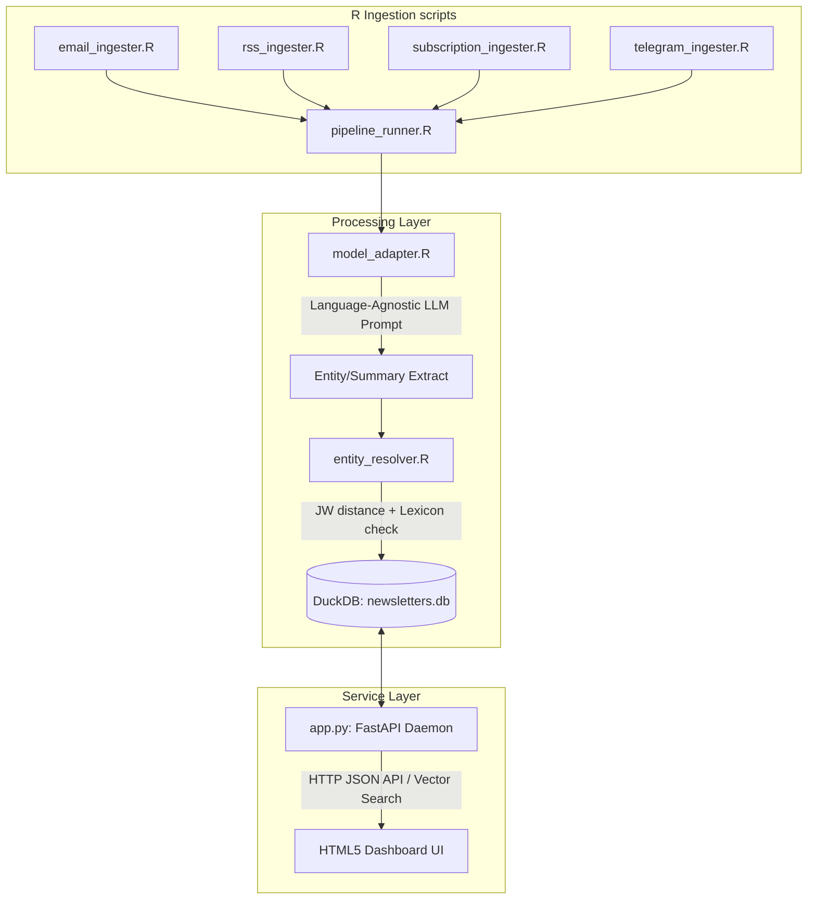

# newsletter_v2 Handoff Documentation

Welcome to the **newsletter_v2** project workspace. This document serves as the technical handoff guide summarizing the architecture, directory layout, database schema, and operational commands for the Phase 2 pipeline.

---

## 1. Directory Structure

All active development modules, sandbox components, and web assets reside in the project workspace as follows:

```
/
├── alpha/                             # Alpha Sandbox Root (Search Dashboard & Pipeline)
│   ├── static/                        # Frontend UI Dashboard
│   │   ├── index.html                 # Glassmorphic HTML5 dashboard
│   │   ├── styles.css                 # Custom CSS variables, transitions & layout
│   │   └── dashboard.js               # Client-side search, slider, auth, history & notifications
│   ├── app.py                         # FastAPI Backend Daemon (Python)
│   ├── config.R                       # Environment configurations parser
│   ├── db_manager.R                   # DuckDB database initialization & connection
│   ├── email_ingester.R               # Secure Gmail IMAP retriever (via mRpostman)
│   ├── rss_ingester.R                 # RSS XML feed ingestion engine
│   ├── subscription_ingester.R        # Substack & Ghost scraper
│   ├── telegram_ingester.R            # Public Telegram web preview scraper
│   ├── fediverse_ingester.R           # Mastodon RSS profile post parser & webpage scraper
│   ├── model_adapter.R                # Model-agnostic LLM/Embedding wrapper
│   ├── entity_resolver.R              # Deduplication engine & canonical lexicon mapper
│   ├── evaluate_nuance.R              # LLM-as-a-judge translation evaluation suite
│   ├── prompts.R                      # Language-agnostic extraction templates
│   ├── pipeline_runner.R              # Core orchestration runner
│   ├── newsletters.db                 # DuckDB narrative corpus database (created on run)
│   └── users.db                       # SQLite personalization storage (auto-created)
├── alpha_survey/                      # Regional Media Ingestion Survey Application Sandbox
│   ├── static/                        # Frontend Single Page App (SPA) assets
│   │   ├── index.html                 # Glassmorphic dashboard UI with stats & controls
│   │   ├── styles.css                 # Clean dark mode layout and micro-animations
│   │   └── app.js                     # DOM handler, API caller, and session auth manager
│   ├── app.py                         # FastAPI Backend REST API containing database & logic layers
│   ├── sources.db                     # Local SQLite database containing logged records & credentials
│   ├── Dockerfile                     # Containerization setup for Cloud Run
│   ├── requirements.txt               # Python package dependencies
│   └── HANDOFF.md                     # Specific survey app technical handoff guide
├── rollout_plan/                      # [GITIGNORED] 6-Month Project Rollout Plan (May 15 - Oct 31, 2026)
│   ├── rollout_plan.md                # Rollout schedule, roadmap phases, and risk mitigations
│   ├── rollout_gantt.csv              # Editable CSV schedule for Google Sheets import
│   └── gantt_chart.png                # Generated visual Gantt chart representation
├── scratch/                           # Agent Temporary Utility Sandbox
│   ├── run_integration_test.R         # End-to-end local validation script
│   ├── test_auth_notifications.py     # Auth & notifications integration tests
│   ├── test_fediverse.R               # Fediverse RSS and webpage scraper tests
│   └── test_survey_api.py             # Survey application API verification tests
├── renv/                              # renv project library config
├── renv.lock                          # Locked R package dependencies
├── CODE_AUDIT_LOG.md                  # Forensic script modification audit trail
├── GOVERNANCE_PROTOCOL.md             # Pipeline resilience and portability guidelines
├── METHODOLOGY.md                     # Algorithms, mathematical models, and architectures
├── README.md                          # Main project quick-start and outline
└── agents.md                          # Sandbox rules and directory isolation requirements
```

---

## 2. Technical Architecture & Data Pipeline



---

## 3. Database Schemas

The system uses a two-tier database architecture to maintain performance and transaction safety: a DuckDB instance (`newsletters.db`) containing the ingested content corpus, and a SQLite instance (`users.db`) isolating user session state and preferences.

### A. Narrative Corpus Database (`newsletters.db` - DuckDB)

#### `newsletters` Table
* **`uid`**: Primary Key (MD5 hash of message content).
* **`datetime`**: Ingestion or publication timestamp (SQL TIMESTAMP).
* **`source`**: Ingestion source name (e.g., RSS feed URL, Telegram channel, email sender).
* **`sender`**: Source publisher/author.
* **`title`**: Original article/email title.
* **`summary`**: English-translated summary.
* **`original_language_summary`**: Original-language summary.
* **`detected_language`**: Detected source language code.
* **`content_type`**: Content category.
* **`topics`**: Comma-separated list of extracted topic keywords.
* **`themes`**: Comma-separated list of extracted thematic pillars.
* **`keywords`**: Comma-separated list of extracted keywords.
* **`english_embedding`**: FLOAT[] array (vector representation of English summary).
* **`multilingual_embedding`**: FLOAT[] array (vector representation of original summary).
* **`url`**: Capture of the original article/post source URL.

#### `entities` Table
* **`uid`**: Reference to `newsletters.uid`.
* **`raw_name`**: Extracted text name variant.
* **`canonical_name`**: Canonical deduplicated name.
* **`entity_type`**: Category (e.g., PERSON, ORGANIZATION, LOCATION).

### B. User Personalization Database (`users.db` - SQLite)

#### `users` Table
* **`username`**: TEXT UNIQUE PRIMARY KEY (Token username).
* **`password_hash`**: TEXT (SHA-256 salted hash of password).
* **`salt`**: TEXT (User-specific hex salt).
* **`created_at`**: TIMESTAMP DEFAULT CURRENT_TIMESTAMP.

#### `search_history` Table
* **`id`**: INTEGER PRIMARY KEY AUTOINCREMENT.
* **`username`**: TEXT (Foreign reference to users).
* **`search_text`**: TEXT (Exact query string run).
* **`space`**: TEXT (Target embedding column: 'english' or 'multilingual').
* **`searched_at`**: TIMESTAMP DEFAULT CURRENT_TIMESTAMP.

#### `saved_searches` Table
* **`id`**: INTEGER PRIMARY KEY AUTOINCREMENT.
* **`username`**: TEXT (Foreign reference to users).
* **`search_text`**: TEXT (Query string).
* **`space`**: TEXT ('english' or 'multilingual').
* **`threshold`**: REAL (Cosine similarity threshold slider value, 0.0 to 1.0).
* **`latest_id`**: TEXT (High-watermark MD5 UID of latest processed matching article).
* **`created_at`**: TIMESTAMP DEFAULT CURRENT_TIMESTAMP.

#### `notifications` Table
* **`id`**: INTEGER PRIMARY KEY AUTOINCREMENT.
* **`username`**: TEXT (Foreign reference to users).
* **`search_text`**: TEXT (Query string that triggered notification).
* **`new_results_count`**: INTEGER (Number of new matching articles found).
* **`newest_title`**: TEXT (Title of the newest matching article).
* **`created_at`**: TIMESTAMP DEFAULT CURRENT_TIMESTAMP.
* **`is_read`**: INTEGER DEFAULT 0 (Unread/Read status flag).

---

## 4. Key Web Dashboard Features

1. **User Authentication & Personalization**:
   * Self-contained registration and credentials-based login.
   * Restricts search history, saved queries, and notifications to authenticated sessions.
2. **Interactive Workspace Sidebar**:
   * Collapsible panel containing **Recent Searches** history list and **Saved Queries** star markers.
   * Clicking recent/saved queries automatically restores search text, selected target space, and runs the query immediately.
3. **Saved Searches & Alert Thresholds**:
   * Clicking the Star icon next to the search box allows users to save a search term with a custom minimum similarity score (e.g. 0.45).
   * Automatically initializes `latest_id` to prevent alert duplication.
4. **Notification Center Dropdown**:
   * Top header bell icon with unread indicator badge.
   * Shows a dropdown log of alerts detailing the matching queries, count of new articles, and newest titles.
   * Includes a manual **"Run Daily Check"** button simulating daily cron triggers.
5. **Vector Search Sensitivity Slider**:
   * Intercepts matches based on cosine similarity scores.
   * Enables users to dial similarity thresholds client-side between `10%` and `90%` for higher recall or precision.
6. **Client-Side CSV Exporter**:
   * Compiles the active filtered search results into a clean, BOM-encoded CSV (`export.csv`).
   * Captures translations, topics, matching cosine scores, and resolved entities.
7. **Interactive Lexicon Tags**:
   * Clicking on resolved entities automatically populates the search bar and triggers a contextual vector-space query.

---

## 5. API Endpoint Architecture

All dashboard operations interact with Python FastAPI backend [app.py](file:///Users/arf/R_projects_local/newsletter_phase2/alpha/app.py) via REST endpoints. Authorization utilizes bearer headers (`Authorization: Bearer <username>`).

| Endpoint | Method | Headers / Auth | Payload Schema | Description / Action |
|---|---|---|---|---|
| `/api/auth/register` | `POST` | None | `{username, password}` | Hashing and registration of user credentials in SQLite `users.db` |
| `/api/auth/login` | `POST` | None | `{username, password}` | Password verification; returns username token upon success |
| `/api/history` | `GET` | `Bearer <username>` | None | Returns the 10 most recent search history logs of the authenticated user |
| `/api/history` | `POST` | `Bearer <username>` | `{search_text, space}` | Appends a search term query record to the user's history |
| `/api/saved-searches` | `POST` | `Bearer <username>` | `{search_text, space, threshold}` | Saves query parameters. Runs initial DuckDB search to seed `latest_id` cursor |
| `/api/saved-searches` | `GET` | `Bearer <username>` | None | Returns list of saved searches for the authenticated user |
| `/api/saved-searches/{id}`| `DELETE` | `Bearer <username>` | None | Removes a saved search (gated by owner validation) |
| `/api/notifications` | `GET` | `Bearer <username>` | None | Fetches all notifications (read and unread) for the authenticated user |
| `/api/notifications/read` | `POST` | `Bearer <username>` | None | Marks all notifications for the authenticated user as read |
| `/api/notifications/check`| `POST` | `Bearer <username>` | None | Manual/cron check simulating daily alerts check against newly ingested articles |
| `/api/search` | `GET` | None | Query params `q`, `space`, `limit` | Computes vector embeddings and runs SQL-native cosine similarity against DuckDB |
| `/api/stats` | `GET` | None | None | Returns high-level database metrics (counts, lang/source splits, entities) |
| `/api/entities` | `GET` | None | None | Returns list of canonical entities and associated raw aliases |

---

## 6. Ingestion Modules & URL Capturing

Phase 2 introduces two new ingestion components:
1. **Fediverse/Mastodon RSS Ingestion** ([fediverse_ingester.R](file:///Users/arf/R_projects_local/newsletter_phase2/alpha/fediverse_ingester.R)): Resolves handles (e.g. `@user@domain`) and parses RSS posts. Appends scraped text if an external target article is shared.
2. **Unified URL Capture**: A `url` column has been appended to the DuckDB schema. All ingesters capture the primary URL path (RSS article link, Telegram post deep link, or scraped external URL) to propagate it down the pipeline.

### Source Ingestion Link Provisioning
The RSS, Telegram, and Fediverse ingestion modules obtain their feed target links/handles from two tiers:
* **Development/Local Pilot**: Hardcoded arrays or program arguments are passed inside the test configurations and [pipeline_runner.R](file:///Users/arf/R_projects_local/newsletter_phase2/alpha/pipeline_runner.R).
* **Production Pipeline**: Links/handles are dynamically pulled from the SQLite database ([sources.db](file:///Users/arf/R_projects_local/newsletter_phase2/alpha_survey/sources.db)) managed by the **Regional Media Ingestion Survey Application**. This enables research auditors to log and verify incoming links through a clean interface before they are consumed by the automated daily ingestion cron.

---

## 7. Deployment & Execution Commands

### To start the FastAPI Backend Daemon (Personalized Search & Notifications):
```bash
# Setup environment variables in .env, then run uvicorn
export USERS_DB_PATH=alpha/users.db
export DUCKDB_PATH=alpha/newsletters.db
export EMBEDDING_PROVIDER=ollama # or openrouter/openai/gemini
export EMBEDDING_MODEL=nomic-embed-text:latest
source .venv/bin/activate
uvicorn alpha.app:app --host 127.0.0.1 --port 8000
```

### To start the Regional Media Ingestion Survey Application:
```bash
# Navigate to workspace root, ensure .venv is active
source .venv/bin/activate
export SURVEY_DB_PATH=alpha_survey/sources.db
export SURVEY_LOG_DIR=alpha_survey/logs
uvicorn alpha_survey.app:app --host 127.0.0.1 --port 8080 --reload
```

### To run the Pipeline Configuration & Database Initialization diagnostics:
```bash
# Verify environment settings and connection setup
Rscript scratch/test_db_and_config.R
```

### To run the Python Authentication & Notifications test suite:
```bash
# Run integration unit tests against active backend/SQLite
python scratch/test_auth_notifications.py
```

### To run the Survey Application API verification tests:
```bash
# Run FastAPI, database, and permissions test suite
python scratch/test_survey_api.py
```

### To run the Fediverse RSS Ingestion test suite:
```bash
# Run R diagnostics validating handle parsing, HTML stripping and RSS fetch
Rscript scratch/test_fediverse.R
```

### To run the general ingestion pipeline test:
```bash
# Run local R integration script (Gmail/RSS/Substack/Telegram)
Rscript scratch/run_integration_test.R
```

### To run translation validation checks:
```bash
# Run LLM-as-a-judge evaluation suite
Rscript alpha/evaluate_nuance.R
```

---

## 8. Regional Media Ingestion Survey Application

The workspace features a self-contained survey dashboard under [alpha_survey/](file:///Users/arf/R_projects_local/newsletter_phase2/alpha_survey) designed for identifying and logging new media source feeds (Telegram public channels, RSS feeds, Fediverse profile URLs) to feed into the main ingestion pipeline.

### Core Security & Scoping
* **Auditor-Scoped Filtering**: Authenticated research assistants (Auditors) only see and manage their own logged entries to maintain privacy and focus.
* **Passcode-Gated Admin Mode**: Unlocked via passcode `admin123` (configured via header `X-Admin-Token`), allowing coordinator-level operations such as deleting, restoring, verifying logs, allocating/revoking auditor accounts, and downloading the full audit log.
* **Audit-Compliant Activity Logger**: Every CRUD operation and administrative action (like bulk CSV export or user creation) is logged with date, user, and action type to [survey_activity.log](file:///Users/arf/R_projects_local/newsletter_phase2/alpha_survey/logs/survey_activity.log).

For full database schema, endpoint reference, local deployment commands, and step-by-step Google Cloud Run + GCS volume mount guidelines, refer to the dedicated [alpha_survey/HANDOFF.md](file:///Users/arf/R_projects_local/newsletter_phase2/alpha_survey/HANDOFF.md) file.

---

## 9. Project Rollout Plan (May 15 – October 31, 2026)

A structured 6-month timeline has been established to scale the platform from its Alpha sandbox stage into a production-grade system. All planning assets are stored in the gitignored [rollout_plan/](file:///Users/arf/R_projects_local/newsletter_phase2/rollout_plan) directory.

### Roadmap Phases
1. **Phase 1: Local Pilot, Validation & Setup** (May 15 – July 3, 2026 / 50 days)
   * Focuses on virtual environments lock-in, source seeding, local pipeline testing, and dual-embedding vector validation.
2. **Phase 2: Cloud Provisioning & Service Hosting** (July 4 – August 2, 2026 / 30 days)
   * Focuses on Docker containerization, Google Cloud Run deployment, and mounting Google Cloud Storage (GCS) volumes to persist SQLite and DuckDB data.
3. **Phase 3: Regional Ingestion & Personalization** (August 3 – September 2, 2026 / 31 days)
   * Focuses on auditor account allocation, user-scoped dashboard views, saved searches, and the daily notification cron scheduler.
4. **Phase 4: Nuance Evaluation & QA** (September 3 – October 2, 2026 / 30 days)
   * Focuses on running the translation judge suite ([evaluate_nuance.R](file:///Users/arf/R_projects_local/newsletter_phase2/alpha/evaluate_nuance.R)), tuning Jaro-Winkler entity resolver thresholds, and CPU/memory profiling.
5. **Phase 5: Production Launch & Operations** (October 3 – October 31, 2026 / 29 days)
   * Focuses on scale intake (100+ channels), VM execution crons (e.g. G2 Spot Instances), logs audits, and final administrative handover.

### Planning Files
* **Strategic Details & Risk Matrix**: [rollout_plan.md](file:///Users/arf/R_projects_local/newsletter_phase2/rollout_plan/rollout_plan.md)
* **Importable Spreadsheet Schedule**: [rollout_gantt.csv](file:///Users/arf/R_projects_local/newsletter_phase2/rollout_plan/rollout_gantt.csv) (compatible with Google Sheets)
* **Visual Gantt Timeline**: [gantt_chart.png](file:///Users/arf/R_projects_local/newsletter_phase2/rollout_plan/gantt_chart.png)

---

## 10. Linear Management
* **Project Name**: `newsletter_v2`
* **Status**: **In Progress** (started)
* **Development Issues**: `NAR-16` through `NAR-23` are **Done**; `NAR-24` is **In Review**.
* **Legacy Issues**: `NAR-1` through `NAR-15` are **Canceled**.
* **Rollout Schedule Issues**: `NAR-25` through `NAR-40` track the 16 tasks of the 6-month rollout plan (May 15 – October 31, 2026) with sequential dependencies (`blockedBy`).
  * **Milestones (Rollout Phases)**:
    1. `Phase 1: Local Pilot` (Target: 2026-07-03) — Tasks: `NAR-25` to `NAR-28`
    2. `Phase 2: Cloud Ingestion` (Target: 2026-08-02) — Tasks: `NAR-29` to `NAR-31`
    3. `Phase 3: Regional Ingest` (Target: 2026-09-02) — Tasks: `NAR-32` to `NAR-34`
    4. `Phase 4: QA & Evaluation` (Target: 2026-10-02) — Tasks: `NAR-35` to `NAR-37`
    5. `Phase 5: Production Launch` (Target: 2026-10-31) — Tasks: `NAR-38` to `NAR-40`
  * **Task Statuses**: `NAR-25` is set to **In Progress** (active May 15 – May 25, 2026), and `NAR-26` through `NAR-40` are in **Todo** state.

