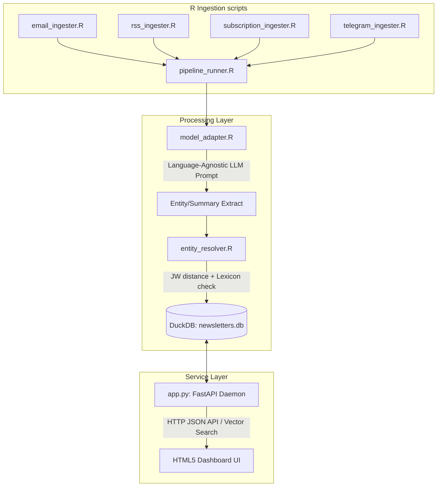

# newsletter_v2 Handoff Documentation

Welcome to the **newsletter_v2** project workspace. This document serves as the technical handoff guide summarizing the architecture, directory layout, database schema, and operational commands for the Phase 2 pipeline.

---

## 1. Directory Structure

All active development modules, sandbox components, and web assets reside under the user-audited sandbox root `alpha/` to avoid contamination of legacy scripts:

```
/
├── alpha/                             # Alpha Sandbox Root
│   ├── static/                        # Frontend UI Dashboard
│   │   ├── index.html                 # Glassmorphic HTML5 dashboard
│   │   ├── styles.css                 # Custom CSS variables, transitions & layout
│   │   └── dashboard.js               # Client-side search, slider & CSV exporter
│   ├── app.py                         # FastAPI Backend Daemon (Python)
│   ├── db_manager.R                   # DuckDB database initialization & connection
│   ├── email_ingester.R               # Secure Gmail IMAP retriever (via mRpostman)
│   ├── rss_ingester.R                 # RSS XML feed ingestion engine
│   ├── subscription_ingester.R        # Substack & Ghost scraper
│   ├── telegram_ingester.R            # Public Telegram web preview scraper
│   ├── model_adapter.R                # Model-agnostic LLM/Embedding wrapper
│   ├── entity_resolver.R              # Deduplication engine & canonical lexicon mapper
│   ├── evaluate_nuance.R              # LLM-as-a-judge translation evaluation suite
│   ├── prompts.R                      # Language-agnostic extraction templates
│   └── pipeline_runner.R              # Core orchestration runner
├── scratch/                           # Agent Temporary Utility Sandbox
│   └── run_integration_test.R         # End-to-end local validation script
├── CODE_AUDIT_LOG.md                  # Forensic script modification audit trail
└── GOVERNANCE_PROTOCOL.md             # Pipeline resilience and portability guidelines
```

---

## 2. Technical Architecture & Data Pipeline



---

## 3. Database Schema (`newsletters.db`)

The local storage layer uses DuckDB to guarantee transactional integrity and fast, thread-safe reading.

### `newsletters` Table
* **`uid`**: Primary Key (MD5 hash of message content).
* **`sender`**: Source publisher/author.
* **`title`**: Original article/email title.
* **`content`**: Full raw text content.
* **`summary_en`**: English-translated summary.
* **`summary_orig`**: Original-language summary.
* **`topics`**: JSON array of extracted topic keywords.
* **`themes`**: JSON array of extracted thematic pillars.
* **`embedding_en`**: Float array (vector representation of English summary).
* **`embedding_orig`**: Float array (vector representation of original summary).
* **`language`**: Detected source language code.
* **`date_ingested`**: ISO 8601 timestamp.

### `entities` Table
* **`uid`**: Reference to `newsletters.uid`.
* **`entity_name`**: Extracted text name.
* **`entity_type`**: Category (e.g., PERSON, ORGANIZATION, LOCATION).

### `entity_lexicon` Table
* **`alias`**: Variant form of entity found in raw texts.
* **`canonical`**: Canonical deduplicated name.

---

## 4. Key Web Dashboard Features

1. **Vector Search Sensitivity Slider**:
   * Intercepts matches based on cosine similarity scores.
   * Enables users to dial similarity thresholds client-side between `10%` and `90%` for higher recall or precision.
2. **Client-Side CSV Exporter**:
   * Compiles the active filtered search results into a clean, BOM-encoded CSV (`export.csv`).
   * Captures translations, topics, matching cosine scores, and resolved entities.
3. **Interactive Lexicon Tags**:
   * Clicking on resolved entities automatically populates the search bar and triggers a contextual vector-space query.

---

## 5. Deployment & Execution Commands

### To start the FastAPI Backend Daemon:
```bash
# Activate python virtual environment and run the server
source .venv/bin/activate
uvicorn alpha.app:app --host 127.0.0.1 --port 8000 --reload
```

### To run the ingestion pipeline test:
```bash
# Run local R integration script
Rscript scratch/run_integration_test.R
```

### To run translation validation checks:
```bash
# Run LLM-as-a-judge evaluation suite
Rscript alpha/evaluate_nuance.R
```

---

## 6. Linear Management
* **Project Name**: `newsletter_v2`
* **Status**: **In Progress** (started)
* **Completed Issues**: `NAR-16` through `NAR-23` updated to **Done**.
* **Legacy Issues**: `NAR-1` through `NAR-15` updated to **Canceled**.
