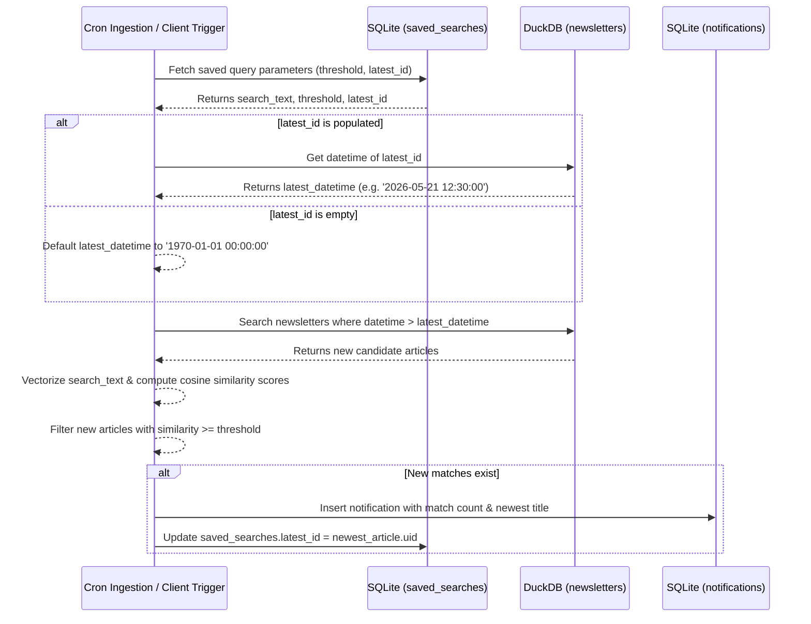

# Phase 2 Pipeline Methodology: Algorithms, Mathematical Models, and Architecture

This document details the mathematical, logical, and programmatic specifications of the core intelligence mechanisms powering the Phase 2 Push Media Engine.

---

## 🌌 1. Dual-Vector Search Space Architecture

To serve both translation-aligned searches and native language retrieval, the engine represents incoming newsletter contents in a dual-vector representation stored in [newsletters.db](file:///Users/arf/R_projects_local/newsletter_phase2/alpha/newsletters.db) (DuckDB).

### Vector Columns
* `english_embedding`: Represents the semantic profile of the English translation/summary.
* `multilingual_embedding`: Represents the semantic profile of the original source text.

### Cosine Similarity Formulation

For a given query vector $\mathbf{Q}$ and database document vector $\mathbf{D}$, similarity is measured using the cosine similarity metric:

$$\text{Similarity}(\mathbf{Q}, \mathbf{D}) = \cos(\theta) = \frac{\mathbf{Q} \cdot \mathbf{D}}{\|\mathbf{Q}\|_2 \|\mathbf{D}\|_2} = \frac{\sum_{i=1}^n Q_i D_i}{\sqrt{\sum_{i=1}^n Q_i^2} \sqrt{\sum_{i=1}^n D_i^2}}$$

### Database Query Execution

DuckDB executes this calculation using the optimized vector function `list_dot_product()`. In Python backend [app.py](file:///Users/arf/R_projects_local/newsletter_phase2/alpha/app.py#L582-L602), L2 normalization is pre-computed on the query vector $\mathbf{Q}$ before binding to avoid redundant computation:

```sql
SELECT 
    uid, 
    datetime::VARCHAR as datetime, 
    source, 
    sender, 
    title, 
    summary,
    (list_dot_product(english_embedding, ?) / (sqrt(list_dot_product(english_embedding, english_embedding)) * ?)) as similarity
FROM newsletters
WHERE english_embedding IS NOT NULL
ORDER BY similarity DESC
LIMIT ?;
```

* The first query parameter `?` is the raw float array of the vectorized search string.
* The second query parameter `?` is the pre-computed magnitude of the query vector:
  $$\|\mathbf{Q}\|_2 = \sqrt{\sum_{i=1}^n Q_i^2}$$

This ensures execution completes in sub-millisecond ranges across the entire corpus.

---

## 🔤 2. Entity Resolution & Jaro-Winkler String Similarity

To deduplicate variations of entities (such as spelling variations, acronyms, or translation anomalies), the pipeline employs an iterative resolution mechanism in [entity_resolver.R](file:///Users/arf/R_projects_local/newsletter_phase2/alpha/entity_resolver.R).

### The Jaro Distance

Given two strings $s_1$ and $s_2$, the Jaro distance $d_j$ is defined as:

$$d_j = \begin{cases} 
0 & \text{if } m = 0 \\
\frac{1}{3} \left( \frac{m}{|s_1|} + \frac{m}{|s_2|} + \frac{m - t}{m} \right) & \text{otherwise} 
\end{cases}$$

Where:
* $|s_i|$ represents the length of string $s_i$.
* $m$ is the number of matching characters. Two characters $s_1[i]$ and $s_2[j]$ are considered matching if they are identical and their index distance satisfies:
  $$|i - j| \le \max\left(1, \left\lfloor \frac{\max(|s_1|, |s_2|)}{2} \right\rfloor - 1\right)$$
* $t$ is the number of transpositions. A transposition is counted when matching characters are out of sequence order.

Programmed in [jaro_distance](file:///Users/arf/R_projects_local/newsletter_phase2/alpha/entity_resolver.R#L16-L65):
```R
match_window <- max(1, floor(max(l1, l2) / 2) - 1)
```

### The Jaro-Winkler Adjustment

Jaro-Winkler distance $d_w$ weights matches that share a common prefix from the start of the string, scaling similarity values up for prefixes:

$$d_w = d_j + \ell \cdot p \cdot (1 - d_j)$$

Where:
* $d_j$ is the standard Jaro distance.
* $\ell$ is the length of the common prefix at the start of the string (up to a maximum of 4 characters).
* $p$ is a constant scaling factor (set to $0.1$ by convention).

Programmed in [jaro_winkler](file:///Users/arf/R_projects_local/newsletter_phase2/alpha/entity_resolver.R#L73-L94).

### The Resolution Pipeline

The function [resolve_entity](file:///Users/arf/R_projects_local/newsletter_phase2/alpha/entity_resolver.R#L107-L151) operates as follows:
1. **Exact Match**: Checks the `entity_lexicon` table for an exact string match (case-insensitive). If found, returns the mapped canonical name.
2. **Fuzzy Match**: If no exact match exists, retrieves all existing canonical names belonging to the same `entity_type`.
3. **Similarity Check**: Computes Jaro-Winkler similarity between the lowercase cleaned input and each lowercase canonical name.
4. **Resolution Gate**:
   * If $\max(d_w) \ge 0.88$, maps the incoming term to the canonical entity yielding the highest score.
   * If $\max(d_w) < 0.88$, creates a new canonical record using the input string.
5. **Lexicon Write**: Persists the mapping combination (`raw_name` $\rightarrow$ `canonical_name`) into `entity_lexicon` using `INSERT OR IGNORE` to build the lookup dictionary dynamically.

---

## 🔒 3. User Credential Security & Authentication

User authorization in the FastAPI backend dashboard utilizes salted cryptography to prevent credential theft.

### Cryptographic Primitives
* **Salt Generation**: Unique random cryptographically secure hex string of length 32 generated using standard library function `secrets.token_hex(16)`.
* **Hash Function**: Hashing combines the raw password text with the unique user salt, evaluated via SHA-256 in [app.py](file:///Users/arf/R_projects_local/newsletter_phase2/alpha/app.py#L77-L85):

$$\text{Password Hash} = \text{SHA256}(\text{Password} \mathbin{\Vert} \text{Salt})$$

```python
def hash_password(password: str, salt: str = None) -> tuple:
    if salt is None:
        salt = secrets.token_hex(16)
    hash_obj = hashlib.sha256((password + salt).encode())
    return hash_obj.hexdigest(), salt
```

### Verification Mode
During sign-in, the stored `salt` associated with the username is pulled from the SQLite user table. The incoming password is combined with this salt and hashed. The transaction succeeds only if the resulting digest matches the stored `password_hash`.

---

## 🔔 4. High-Watermark Alert Evaluation & Notifications

The notifications module detects new matching articles without scanning the entire historical database by utilizing a temporal database cursor (High-Watermark).



The algorithm implemented in [check_notifications](file:///Users/arf/R_projects_local/newsletter_phase2/alpha/app.py#L467-L549):
1. **Query Retreival**: Reads all active entries from the SQLite `saved_searches` table.
2. **Cursor Evaluation**: If a search holds a valid `latest_id`, fetches its publication datetime from DuckDB:
   ```sql
   SELECT datetime::VARCHAR FROM newsletters WHERE uid = ?;
   ```
   If no `latest_id` is set, the threshold cursor defaults to `'1970-01-01 00:00:00'`.
3. **Similarity Scan**: Generates the query embedding, and executes semantic search limited to records newer than the threshold cursor:
   ```sql
   SELECT 
       uid, 
       title,
       datetime::VARCHAR as datetime,
       (list_dot_product(english_embedding, ?) / (sqrt(list_dot_product(english_embedding, english_embedding)) * ?)) as similarity
   FROM newsletters
   WHERE english_embedding IS NOT NULL AND datetime > ?
   ORDER BY datetime DESC, similarity DESC;
   ```
4. **Alert Trigger**: Checks similarity scores. For any items exceeding the saved threshold:
   * Inserts an entry into the SQLite `notifications` table mapping the user, query terms, total count of new articles, and the newest title.
   * Updates the `latest_id` column of `saved_searches` to the `uid` of the newest matching article, moving the high-watermark cursor forward.

---

## 🌐 5. Webpage Scraping Fallback Pipeline

In Mastodon and Fediverse posts, raw status text is often short and contains links to external articles. To provide useful summaries and entities, [fediverse_ingester.R](file:///Users/arf/R_projects_local/newsletter_phase2/alpha/fediverse_ingester.R) implements a webpage parsing pipeline.

### Step 1: External Link Filtering

The ingestion parser scans parsed post HTML descriptions, extracts `href` attributes, and filters them using [is_actual_article_link](file:///Users/arf/R_projects_local/newsletter_phase2/alpha/fediverse_ingester.R#L39-L50) to ignore internal platform navigation links:

```R
is_actual_article_link <- function(url) {
    if (is.na(url) || url == "") return(FALSE)
    if (!grepl("^https?://", url)) return(FALSE)
    
    # Exclude typical Fediverse structures (profiles, statuses, tags, media)
    if (grepl("/tags/|/explore/|/media/|/files/|/assets/", url, ignore.case = TRUE)) return(FALSE)
    if (grepl("/@", url, fixed = TRUE)) return(FALSE)
    if (grepl("/users/", url, fixed = TRUE)) return(FALSE)
    if (grepl("/statuses/", url, fixed = TRUE)) return(FALSE)
    
    return(TRUE)
}
```

### Step 2: Web Scraping and Element Selection

If a URL passes the filter, the ingestion script invokes [scrape_webpage_content](file:///Users/arf/R_projects_local/newsletter_phase2/alpha/fediverse_ingester.R#L58-L93):
1. **HTTP Fetch**: Makes a GET request using the `httr2` package, configured with an automatic retry block (`req_retry(max_tries = 3)`).
2. **DOM Parsing**: Reads the raw HTML body via `rvest::read_html`.
3. **Selector Matching**: Attempts to extract structural article tags by querying common container nodes:
   ```R
   body_node <- rvest::html_node(web_page, "article, .post-content, .article-content, .entry-content")
   ```
4. **Fallback**: If no article containers match, falls back to fetching all text contents inside paragraph (`p`) nodes:
   ```R
   p_nodes <- rvest::html_nodes(web_page, "p")
   text_content <- paste(rvest::html_text(p_nodes), collapse = "\n\n")
   ```
5. **Payload Compilation**: Cleaned text content is appended to the post description. The source `url` column in the database is overwritten with the target external webpage URL, allowing subsequent LLM stages to summarize the full article text.
