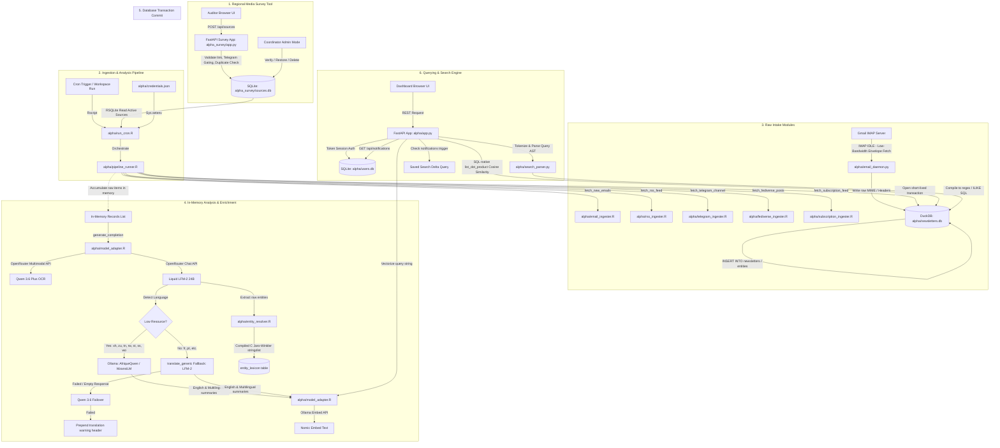

# Phase 2 Narrative Intelligence Pipeline Architecture & Operations Manual

This document provides a detailed technical reference for the Phase 2 Narrative Intelligence Ingestion, Analysis, and Querying Pipeline.



---

## 1. Central Manifest Configuration (`manifest.json`)

The pipeline's model dependency injection is managed through a central `manifest.json` file. The R configuration layer ([config.R](file:///Users/arf/R_projects_local/newsletter_phase2/alpha/config.R)) parses this manifest on startup to set system defaults, enabling model agnosticism and simplified model maintenance.

```json
{
  "project": "newsletter_v2",
  "version": "1.0",
  "pipeline_models": {
    "metadata_extraction": {
      "provider": "openrouter",
      "model": "liquid/lfm-2-24b-a2b",
      "description": "Used for language detection, translation, summarization, entity extraction, and category classification."
    },
    "vector_embeddings": {
      "provider": "ollama",
      "model": "nomic-embed-text:latest",
      "description": "Used to generate 768-dimensional dual-space embeddings (English and Multilingual) for semantic vector search."
    },
    "translation_evaluation": {
      "provider": "openrouter",
      "model": "liquid/lfm-2-24b-a2b",
      "description": "LLM-as-a-judge model used to evaluate translation accuracy, nuance, and rhetorical fidelity."
    }
  }
}
```

### Parsing & Dynamic Environment Override
- **Manifest Read**: `get_config()` reads `manifest.json` using `jsonlite::read_json` and extracts the provider/model combinations.
- **Environment Overrides**: If matching environment variables (e.g. `LLM_PROVIDER`, `LLM_MODEL`, `EMBEDDING_PROVIDER`, `EMBEDDING_MODEL`) are defined on the host system, they take precedence over the manifest values, allowing runtime deployment flexibility (e.g., swapping local Ollama and cloud APIs on-the-fly).

---

## 2. Ingestion Pipeline: Step-by-Step

### Step 1: Ingestion of Sources into the Source Database

The ingestion loop begins at the **Regional Media Ingestion Survey Application** ([alpha_survey/app.py](file:///Users/arf/R_projects_local/newsletter_phase2/alpha_survey/app.py)), which governs the lifecycle of ingestion feeds:

1. **User Authentication & Scoped Access Control**:
   - Users authenticate via credentials-based logins stored in `alpha_survey/sources.db`. Password validation uses SHA256 hashes with unique salts.
   - **Scoped Views**: Regular auditors are restricted to viewing and filtering only their own logged inputs. The Coordinator can access "Admin Mode" using a secure token gate to manage users and access global directories.
2. **Input Prevention & Security Gating**:
   - Before a feed is added, the server validates fields against strict schemas.
   - **Telegram Gating**: Blocks private group/invite links by rejecting strings containing `joinchat`, `+` or `#`. Only public, scrapable channels (`t.me/s/{channel}`) are accepted.
   - **Duplicate Gating**: Ensures the `ingest_url` does not already exist in the database.
3. **ID Serialization**:
   - The server dynamically generates a unique `source_id` combining regional taxonomy codes: `{Country}_{Platform}_{Topic}_{Num}` (e.g., `SEN_TEL_POL_001`).
4. **Verification & Audit Logs**:
   - When a source is submitted, it is flagged as unverified. The coordinator can review the feed, mark it as active, and toggle the `is_verified` state.
   - Every insertion, deletion, and verification is logged in `alpha_survey/logs/survey_activity.log` for compliance.

### Step 2: Source Discovery & Cron Orchestration

The daily execution cycle is kicked off by the unattended execution entry point: [run_cron.R](file:///Users/arf/R_projects_local/newsletter_phase2/alpha/run_cron.R).

1. **Credentials Parsing**:
   - Reads [credentials.json](file:///Users/arf/R_projects_local/newsletter_phase2/alpha/credentials.json) and injects API keys, DB paths, and model selections into R environment variables via `Sys.setenv`.
2. **SQLite Lookup**:
   - Connects to `alpha_survey/sources.db` using the native **RSQLite** driver.
   - Executes a query to extract all active (`is_deleted = 0`) source URLs grouped by platform:
     ```sql
     SELECT platform, source_name, ingest_url FROM sources WHERE is_deleted = 0;
     ```
3. **Pipeline Invocations**:
   - Parses RSS URLs into a named R list, extracts channel handles from Telegram links, and builds Fediverse handle lists.
   - Passes the parameters to `run_pipeline()` inside [pipeline_runner.R](file:///Users/arf/R_projects_local/newsletter_phase2/alpha/pipeline_runner.R).

### Step 3: Raw Intake Processing

The pipeline runner routes ingestion tasks to platform-specific modules, each returning a standardized R list of records:

- **Email Ingestion**:
  - **Daemon Mode ([email_daemon.py](file:///Users/arf/R_projects_local/newsletter_phase2/alpha/email_daemon.py))**: Connects via IMAP IDLE to receive instant notifications of new emails.
  - **Low-Bandwidth Partial Fetch**: To prevent exceeding Google's daily 2.5 GB download limit, the daemon queries only the envelope headers and text parts (`BODY[TEXT]`), bypassing attachments.
  - **R Fallback ([email_ingester.R](file:///Users/arf/R_projects_local/newsletter_phase2/alpha/email_ingester.R))**: Parses MIME structures, decodes Quoted-Printable/Base64 payloads via a native R QP decoder, decodes folded subject/sender headers, and extracts canonical "View in browser" links.
- **RSS Ingestion ([rss_ingester.R](file:///Users/arf/R_projects_local/newsletter_phase2/alpha/rss_ingester.R))**:
  - Fetches XML/Atom feeds using `xml2` and `rvest`. Cleans HTML tags and entities, parses dates using a robust multi-format parser (`parse_rss_date`), and hashes links to check for duplicates.
- **Telegram Ingestion ([telegram_ingester.R](file:///Users/arf/R_projects_local/newsletter_phase2/alpha/telegram_ingester.R))**:
  - Scrapes the public web widget (`t.me/s/{channel}`) using `rvest`. Matches `.tgme_widget_message_photo_wrap` elements to extract the `background-image` URL style attributes, processing image-only posts.
- **Fediverse Ingestion ([fediverse_ingester.R](file:///Users/arf/R_projects_local/newsletter_phase2/alpha/fediverse_ingester.R))**:
  - Fetches Mastodon RSS XML feeds. Searches for external links in the posts (ignoring profiles, tags, and media) and fetches/scrapes the full target page text to enrich the ingestion body.
- **Subscription Ingestion ([subscription_ingester.R](file:///Users/arf/R_projects_local/newsletter_phase2/alpha/subscription_ingester.R))**:
  - Handles Substack/Ghost feeds via RSS and direct scraping.

**Schema Consistency**: All ingester records are mapped to the uniform schema:
`list(uid, datetime, source, sender, title, url, body, platform, raw_source, image_url)`

### Step 4: LLM-Based Analysis & Extraction

The orchestrator iterates over new in-memory records and queries the LLM:

1. **Multimodal Vision/OCR**:
   - If `image_url` is present, `generate_completion` overrides the configured LLM to run the **Vision Model** (`qwen/qwen3.6-plus` via OpenRouter).
   - Structures the prompt inside a standard OpenRouter multimodal JSON content array:
     ```json
     [
       { "type": "text", "text": "Prompt..." },
       { "type": "image_url", "image_url": { "url": "https://..." } }
     ]
     ```
   - The vision model returns a `contains_text` boolean. If `false` (scenery or graphic), the pipeline bypasses downstream translation and populates placeholders (`*(Media post containing no readable text)*`). If `true`, it extracts the text and flags the record with an OCR footnote.
2. **JSON Metadata Extraction**:
   - For text posts, the runner formats the title, sender, and body into a structured extraction prompt ([prompts.R](file:///Users/arf/R_projects_local/newsletter_phase2/alpha/prompts.R)).
   - **Instruction Guidelines**: Prompts enforce direct journalistic summaries in the original language (`summary_orig`) and English (`summary_en`), prohibiting self-referential conversational preambles (e.g. "The article describes...").
   - **Token Throttling & Repeat Safeguards**:
     - Uses `max_tokens = 4000` to prevent truncation of large digest newsletters.
     - Runs regex check `(.{3,})\1{8,}` to detect repeating tokens (a failure mode of Liquid LFM-2 under certain unicode characters), triggering a retry on detection.
     - Strips markdown formatting to parse clean JSON.

### Step 5: Translation & Fallback Hardening

To support multilingual retrieval, summaries must be translated to English:

1. **Language Check**:
   - If the detected language matches the low-resource list (`xh`, `zu`, `tn`, `rw`, `st`, `ss`, `wo`), the pipeline invokes `translate_ollama()` using local models (e.g., `AfriqueQwen` / `MzansiLM`).
   - If a cloud model slug is configured, it routes the translation through OpenRouter's completion API. Matches are cached in a SQLite cache `alpha/ollama_cache.db` using SHA256 hashes.
2. **Hardened Generic Fallback**:
   - For standard languages (French, Portuguese, etc.), or if local Ollama calls fail, the pipeline calls `translate_generic()`.
   - **Multi-Stage Failover**:
     - **Attempt 1**: Queries the primary manifest LLM (Liquid LFM-2).
     - **Attempt 2**: If Attempt 1 fails, returns empty text, or returns the untranslated input, it falls back to **Qwen 3.6 Plus** (`qwen/qwen3.6-plus` via OpenRouter).
     - **Attempt 3 (Warning Prefix)**: If both models fail, it returns the original text prefixed with `[Translation Failed - Original Language: {lang}]` to prevent silent overwriting of the English summary fields.

### Step 6: Entity Resolution & Deduplication

Extracted entities are processed in [entity_resolver.R](file:///Users/arf/R_projects_local/newsletter_phase2/alpha/entity_resolver.R):

1. **Jaro-Winkler Similarity**:
   - Compares raw entity names against the `entity_lexicon` DuckDB table.
   - Utilizes the compiled, high-performance C-based `stringdist` library with method `"jw"` (Jaro-Winkler threshold $\ge 0.88$).
2. **Canonical Mapping**:
   - If a close match is found under the same type (PERSON, ORG, GPE, LOC), the entity is mapped to that canonical name. If no match is found, the raw name is saved as a new canonical entry.
   - **No Schema Locks**: The database schema does not enforce `FOREIGN KEY` constraints on the `entities` table to avoid DuckDB catalog validation locking during bulk updates.

### Step 7: Dual-Space Vector Embedding Generation

For semantic vector search, two separate 768-dimensional float arrays are generated using **Nomic Embed Text**:

1. **English Space**:
   - Embeds the English summary combined with the extracted topics and themes:
     `summary_en + "\nTopics: " + topics + "\nThemes: " + themes`
   - Appending metadata tags ensures these structural markers are indexed inside the semantic vector space.
2. **Multilingual Space**:
   - Embeds the original language summary combined with the topics and themes:
     `summary_orig + "\nTopics: " + topics + "\nThemes: " + themes`

### Step 8: In-Memory DB Transaction Commit

To ensure high performance and prevent write locks:
1. All slow operations (network requests, LLM analysis, translation, and embeddings) are processed in-memory while the database connection is closed.
2. At the end of the ingestion run, a single transaction block opens a DuckDB connection and commits all records and entities in milliseconds:
   ```sql
   BEGIN TRANSACTION;
   INSERT INTO newsletters ...;
   INSERT INTO entities ...;
   COMMIT;
   ```
3. This keeps the database unlocked and readable by the FastAPI server during active ingestion.

---

## 3. Querying Process: Step-by-Step

Once records are written to `alpha/newsletters.db`, the query pipeline handles searching, filtering, and alert generation:

```
[User Search Request]
        │
        ▼
[FastAPI: /api/search]
        │
        ├── Auth Session Check (SQLite: users.db)
        │
        ├── Determine Search Type
        │     │
        │     ├─► SEMANTIC SEARCH:
        │     │     1. Vectorize query string (Ollama / OpenRouter) -> 768-dim float array
        │     │     2. Run DuckDB SQL query using Cosine Similarity:
        │     │        (list_dot_product(english_embedding, ?) / (sqrt(list_dot_product(col, col)) * ?))
        │     │
        │     └─► KEYWORD SEARCH:
        │           1. Tokenize query (AND, OR, NOT, NEAR, Phrases, Wildcards)
        │           2. Parser compiles AST -> ILIKE / REGEXP_MATCHES SQL clauses
        │
        ├── Apply Database Filters (content_type, detected_language, start_date, end_date)
        │
        ├── Execute SQL in DuckDB (Read-Only session, max_memory=2GB, threads=2)
        │
        ├── Aggregate Metadata (Timeline counts, total matches, pagination limit/offset)
        │
        ▼
[REST JSON Payload Response]
```

### Step 1: REST API Routing & Session Auth
- FastAPI ([app.py](file:///Users/arf/R_projects_local/newsletter_phase2/alpha/app.py)) handles endpoints.
- **Session Auth**: Gated by a custom dependency `get_current_user` reading `Authorization: Bearer {token}` headers. Validates session tokens against the user database (`alpha/users.db`).

### Step 2: Vector Search & Matching
1. **Query Vectorization**:
   - Translates the user's query string into a 768-dimensional float array using the configured embedding provider (`nomic-embed-text` via Ollama/OpenRouter).
2. **Cosine Similarity SELECT**:
   - Performs a SQL-native cosine vector comparison using DuckDB's built-in `list_dot_product` and vector norms:
     ```sql
     SELECT 
         uid, title, summary, content_type, datetime,
         (list_dot_product(english_embedding, ?) / (sqrt(list_dot_product(english_embedding, english_embedding)) * ?)) as similarity
     FROM newsletters
     WHERE english_embedding IS NOT NULL
     ORDER BY similarity DESC;
     ```
   - Passes the query vector and its pre-calculated norm as query parameters.
3. **Threshold Gates**:
   - The user interface sensitivity slider passes a similarity threshold. The backend applies this constraint directly in the SQL `WHERE` clause (e.g., `similarity >= ?`) to filter out weak matches at the database level.
4. **Target Space**:
   - The frontend toggles between "English" (queries `english_embedding`) and "Multilingual" (queries `multilingual_embedding` to match native language summaries).

### Step 3: Keyword Parsing & Search AST
When `search_type=keyword` is selected, the server bypasses the embedding model and compiles the search string into structured SQL via [search_parser.py](file:///Users/arf/R_projects_local/newsletter_phase2/alpha/search_parser.py):

1. **Tokenizer**:
   - Scans the search string using a regular expression regex mapping tokens:
     - Quotes (`"..."`) $\rightarrow$ `PHRASE`
     - Parentheses (`(`, `)`) $\rightarrow$ `LPAREN`, `RPAREN`
     - Boolean operators (`AND`, `OR`, `NOT`) $\rightarrow$ `OP`
     - Proximity syntax (`NEAR/d`) $\rightarrow$ `NEAR` (where `d` is the word distance)
     - Standard words $\rightarrow$ `TERM`
2. **Recursive Descent Parser**:
   - Compiles tokens into an Abstract Syntax Tree (AST) following operator precedence: `OR` $\rightarrow$ `AND` $\rightarrow$ `NOT` $\rightarrow$ `PRIMARY`.
3. **SQL Compiler Nodes**:
   - **TermNode**: Translates wildcards (converts `*` to `%` and `?` to `_`). Returns case-insensitive `ILIKE` clauses searching titles and summaries:
     `((title ILIKE ?) OR (summary ILIKE ?))`
   - **PhraseNode**: Compares exact phrase matches using `ILIKE`.
   - **NearNode**: Converts proximity searches (e.g., `trump NEAR/5 tariff`) into regular expression matches executed natively in DuckDB:
     `REGEXP_MATCHES(summary, 'trump(?:\W+\w+){0,5}\W+tariff|tariff(?:\W+\w+){0,5}\W+trump', 'i')`
   - **And / Or / Not Nodes**: Concatenates child subqueries with standard SQL boolean syntax (`AND`, `OR`, `NOT`).

### Step 4: Dynamic Results Aggregation & Formatting
- **Read-Only Session**: Connects to DuckDB with `read_only=True` to prevent write locks, setting limits (`max_memory = '2GB'`, `threads = 2`).
- **Pagination**: Applies SQL `LIMIT` and `OFFSET` parameters based on page index.
- **Count & Timeline Distribution**:
  - Executes a `COUNT(*)` query to return the total matches matching the query and filters (e.g., "Showing 1-20 of 6,000 matches").
  - Groups matching records by date to construct the timeline distribution array:
    ```sql
    SELECT datetime::DATE::VARCHAR as date, COUNT(*) as count 
    FROM newsletters WHERE ... GROUP BY datetime::DATE;
    ```
  - This allows the frontend to render the line chart displaying the timeline of matching posts.
- **Entity Join aggregation**:
  - Dynamically packages related entities inside the results list using a SQL subquery join:
    ```sql
    SELECT string_agg(canonical_name || ':' || entity_type, ';') 
    FROM entities WHERE entities.uid = newsletters.uid;
    ```
- **EML Downloads**:
  - Fetches the raw MIME email content from the `raw_email` column, formats headers, and returns it as a `.eml` file attachment response.

### Step 5: Saved Searches & Workspace Notifications
1. **Saved Query Initialization**:
   - When a user saves a query, the FastAPI backend vectorizes the search text and queries DuckDB for the newest matching article ID (`latest_id`) exceeding the similarity threshold.
   - Inserts the query, space, threshold, and `latest_id` into SQLite `saved_searches`.
2. **Delta Query Checker**:
   - The workspace periodically triggers `/api/notifications/check` (simulated via cron or dashboard buttons).
   - For each saved search, it checks for newer articles:
     ```sql
     SELECT uid, title, datetime FROM newsletters 
     WHERE english_embedding IS NOT NULL AND datetime > ?;
     ```
   - Compares similarity values against the saved threshold.
   - If new matches exist:
     - Inserts a record into the SQLite `notifications` table containing the match count and the title of the newest post.
     - Updates `saved_searches.latest_id` to the newest match's ID.
   - The user's dashboard queries `/api/notifications` to display alerts and update the notification indicator.
