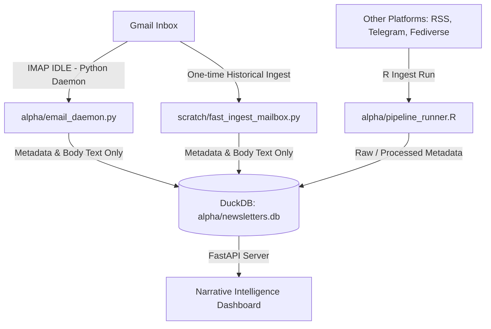

# Alpha Ingestion & Analysis Pipeline Architecture

This document outlines the architecture and execution instructions for the Alpha Phase 2 Ingestion and Analysis Pipeline.

## System Architecture

The pipeline uses a hybrid R/Python architecture designed for low latency, low resource environments, and Google's IMAP rate limits.



### 1. Real-Time Gmail Ingestion (Python Daemon)
- **Script**: [email_daemon.py](file:///Users/arf/R_projects_local/newsletter_phase2/alpha/email_daemon.py)
- **Strategy**: Uses `imapclient` to connect to Gmail once, selects `INBOX`, and issues the `IDLE` command. Google's server pushes new email notifications instantly.
- **Low-Bandwidth Fetching**: Under [email_ingester.py](file:///Users/arf/R_projects_local/newsletter_phase2/alpha/email_ingester.py), we fetch only the message envelope headers and specific text parts (e.g. `BODY[TEXT]`), completely bypassing massive attachments to stay within Google's 2.5 GB daily download limit.
- **Auto-Sync / Reconnect**: On startup and reconnection, it runs a fast sync scanning only the last 7 days of emails to fetch anything missed during downtime.

### 2. Batch Historical Ingestion
- **Script**: [fast_ingest_mailbox.py](file:///Users/arf/R_projects_local/newsletter_phase2/scratch/fast_ingest_mailbox.py)
- **Strategy**: A high-performance Python CLI tool that handles year-by-year partition searches, filters duplicates, fetches text parts in chunks, and processes LLM extractions and embeddings in parallel (4 threads) to insert directly into DuckDB.

### 3. Multi-Source Orchestrator (R Pipeline)
- **Script**: [pipeline_runner.R](file:///Users/arf/R_projects_local/newsletter_phase2/alpha/pipeline_runner.R)
- **Strategy**: Handles periodic batch runs of RSS feeds, Mastodon/Fediverse handles, Telegram channels, and other static ingestion endpoints, saving structured entries to DuckDB.

---

## Database Schema

All data is written to the local DuckDB database at `alpha/newsletters.db`:
- **`newsletters`**: Stores unique newsletter posts. Key columns:
  - `uid`: Unique identifier (e.g. `body13833` for Gmail).
  - `english_embedding` & `multilingual_embedding`: Native `FLOAT[]` vector representations.
  - `raw_email`: Saved headers and body text (optional/fallback).
- **`entities`**: Resolved occurrences of entities (People, Organizations, Locations) mapped back to `newsletters.uid`.
- **`entity_lexicon`**: Map of raw entity names to their deduplicated `canonical_name` using Jaro-Winkler distance.

---

## How to Run

### 1. Start the Real-Time Email Daemon
Run the Python daemon in the background to capture new emails immediately:
```bash
.venv/bin/python alpha/email_daemon.py
```

### 2. Run the Legacy Mailbox Ingest / Backfill
To backfill all historical emails:
```bash
.venv/bin/python scratch/fast_ingest_mailbox.py
```

### 3. Run the FastAPI Server
To launch the dashboard backend (running on port 8000):
```bash
.venv/bin/uvicorn alpha.app:app --host 127.0.0.1 --port 8000
```
